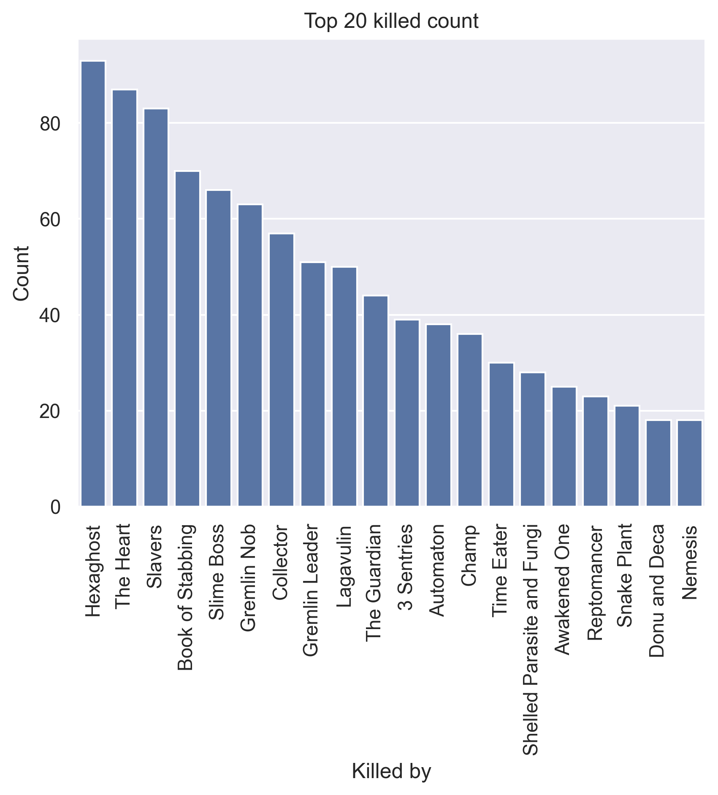
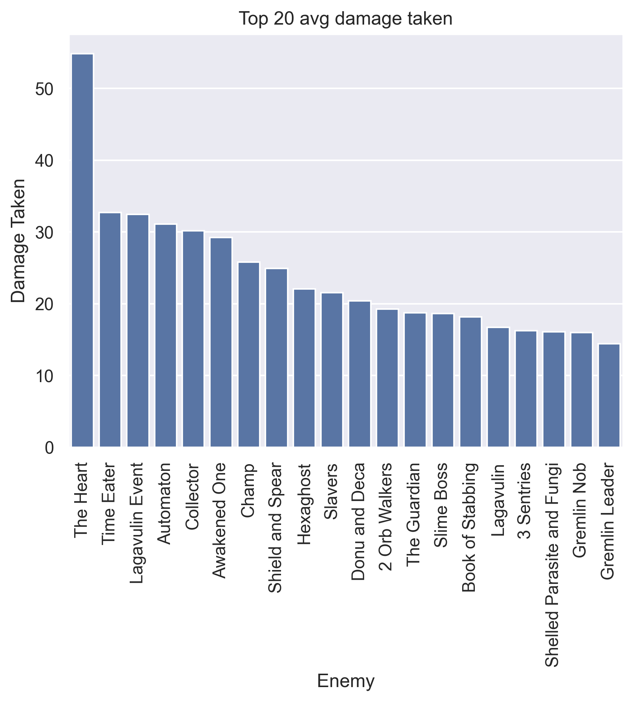
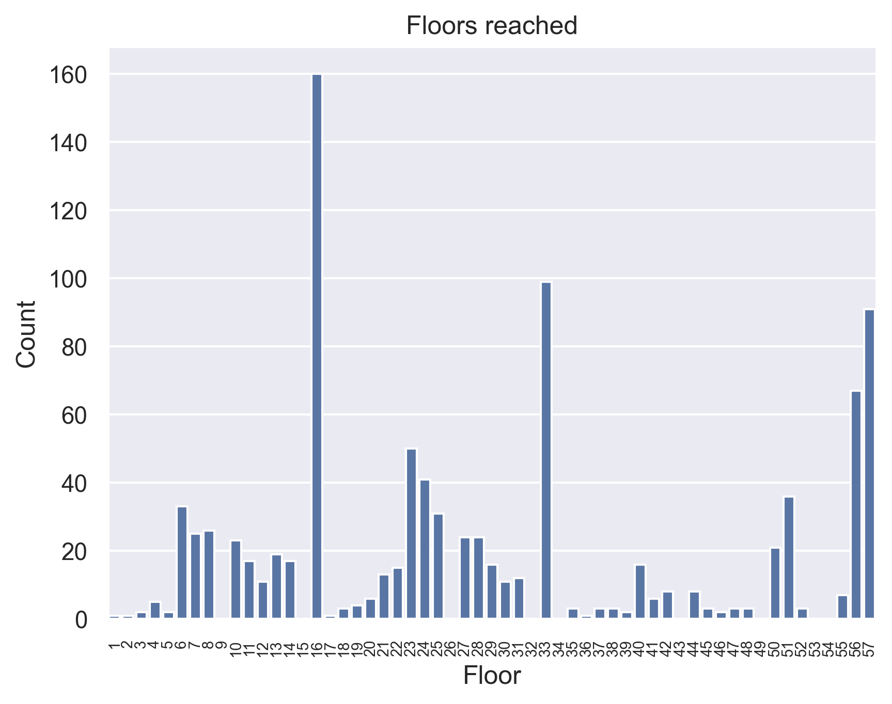
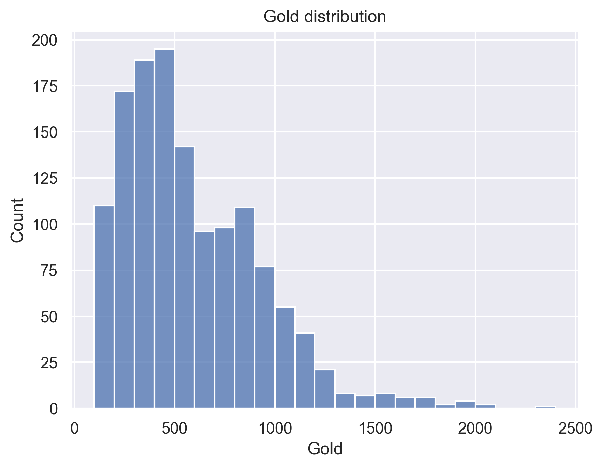

## General stats
- Total games played: 1393
- Win rate (%): 11.56
- Avg playtime (mins): 31.97
- Avg floor reached: 29.34
- Max score: 3594
- Times rest: 1.2
- Times smith: 3.25
- Max hp >= 80: 378
- Max hp <= 40: 29

### Top 10 damage taken fights (excluding heart)
| Enemy            |   Damage Taken |
|------------------|----------------|
| Snake Plant      |         100027 |
| Shield and Spear |            183 |
| Donu and Deca    |            176 |
| Time Eater       |            154 |
| Collector        |            148 |
| Champ            |            143 |
| Time Eater       |            140 |
| Collector        |            139 |
| Automaton        |            136 |
| Automaton        |            130 |

## Card stats
### Top 10 card removed count
| Card      |   Count |
|-----------|---------|
| Strike_R  |     318 |
| Strike_G  |     309 |
| Strike_B  |     172 |
| Strike_P  |     170 |
| Defend_P  |     166 |
| Defend_G  |      82 |
| Doubt     |      42 |
| Defend_B  |      38 |
| Defend_R  |      35 |
| Normality |      29 |

### Top 80 card win rate (exclude duplicate)
| Card               |   Win rate |     | Card              |   Win rate |
|--------------------|------------|-----|-------------------|------------|
| J.A.X.             |       1    |     | Impatience        |       0.3  |
| Good Instincts     |       0.54 |     | EmptyMind         |       0.3  |
| Panacea            |       0.5  |     | Parasite          |       0.29 |
| Normality          |       0.5  |     | Meditate          |       0.29 |
| Finesse            |       0.46 |     | Infinite Blades   |       0.29 |
| Purity             |       0.44 |     | Concentrate       |       0.29 |
| DevaForm           |       0.42 |     | WheelKick         |       0.29 |
| PanicButton        |       0.4  |     | Secret Weapon     |       0.29 |
| Setup              |       0.4  |     | CurseOfTheBell    |       0.29 |
| Madness            |       0.39 |     | Swift Strike      |       0.29 |
| Weave              |       0.38 |     | LikeWater         |       0.29 |
| Body Slam          |       0.38 |     | ClearTheMind      |       0.29 |
| Swivel             |       0.38 |     | Alchemize         |       0.28 |
| Establishment      |       0.37 |     | Flechettes        |       0.28 |
| Force Field        |       0.35 |     | MentalFortress    |       0.28 |
| Sentinel           |       0.35 |     | Adrenaline        |       0.28 |
| Outmaneuver        |       0.34 |     | Scrape            |       0.27 |
| Clumsy             |       0.33 |     | Bandage Up        |       0.27 |
| Wish               |       0.33 |     | Blur              |       0.27 |
| Dark Shackles      |       0.33 |     | Core Surge        |       0.27 |
| Trip               |       0.33 |     | Prostrate         |       0.27 |
| Sadistic Nature    |       0.33 |     | Impervious        |       0.27 |
| DeceiveReality     |       0.33 |     | Thunder Strike    |       0.27 |
| Jack Of All Trades |       0.33 |     | Apotheosis        |       0.27 |
| Distraction        |       0.33 |     | Calculated Gamble |       0.27 |
| Omniscience        |       0.32 |     | Worship           |       0.26 |
| Dropkick           |       0.32 |     | Brutality         |       0.26 |
| Aggregate          |       0.32 |     | Bullet Time       |       0.26 |
| Brilliance         |       0.32 |     | Vault             |       0.26 |
| Blasphemy          |       0.31 |     | InnerPeace        |       0.26 |
| Protect            |       0.31 |     | Warcry            |       0.26 |
| Double Energy      |       0.31 |     | Turbo             |       0.25 |
| Barricade          |       0.31 |     | Panache           |       0.25 |
| Master of Strategy |       0.3  |     | Fusion            |       0.25 |
| Malaise            |       0.3  |     | Hyperbeam         |       0.25 |
| Evolve             |       0.3  |     | Magnetism         |       0.25 |
| Scrawl             |       0.3  |     | LessonLearned     |       0.25 |
| Flash of Steel     |       0.3  |     | Secret Technique  |       0.25 |
| Deep Breath        |       0.3  |     | Exhume            |       0.25 |
| Heavy Blade        |       0.3  |     | Nirvana           |       0.25 |

### Card pick rate act 1 (exclude boss)
| Card               |   Pick rate |     | Card               |   Pick rate |
|--------------------|-------------|-----|--------------------|-------------|
| Bandage Up         |        1    |     | Fission            |        0.25 |
| Dramatic Entrance  |        1    |     | Eviscerate         |        0.25 |
| Apotheosis         |        1    |     | Forethought        |        0.25 |
| HandOfGreed        |        0.93 |     | Thinking Ahead     |        0.25 |
| Feed               |        0.92 |     | Mind Blast         |        0.25 |
| Biased Cognition   |        0.91 |     | Enlightenment      |        0.25 |
| Adrenaline         |        0.89 |     | Double Tap         |        0.25 |
| Vault              |        0.88 |     | Slice              |        0.24 |
| Glacier            |        0.87 |     | Fire Breathing     |        0.24 |
| Scrawl             |        0.85 |     | Sanctity           |        0.24 |
| Fiend Fire         |        0.85 |     | Static Discharge   |        0.24 |
| Seek               |        0.84 |     | Underhanded Strike |        0.24 |
| Adaptation         |        0.81 |     | True Grit          |        0.24 |
| Tantrum            |        0.8  |     | Storm of Steel     |        0.23 |
| Swift Strike       |        0.8  |     | Reckless Charge    |        0.23 |
| Electrodynamics    |        0.8  |     | Infernal Blade     |        0.22 |
| Immolate           |        0.79 |     | BattleHymn         |        0.22 |
| Blade Dance        |        0.78 |     | Deadly Poison      |        0.22 |
| Defragment         |        0.77 |     | Poisoned Stab      |        0.22 |
| Echo Form          |        0.74 |     | Barrage            |        0.22 |
| Die Die Die        |        0.72 |     | Combust            |        0.21 |
| Noxious Fumes      |        0.72 |     | Hyperbeam          |        0.21 |
| Reaper             |        0.71 |     | Tactician          |        0.21 |
| After Image        |        0.71 |     | Clothesline        |        0.21 |
| FearNoEvil         |        0.71 |     | Halt               |        0.21 |
| InnerPeace         |        0.7  |     | Hello World        |        0.21 |
| Alchemize          |        0.68 |     | Wild Strike        |        0.21 |
| Flame Barrier      |        0.67 |     | CrushJoints        |        0.2  |
| Doom and Gloom     |        0.66 |     | Beam Cell          |        0.2  |
| Offering           |        0.66 |     | FlyingSleeves      |        0.2  |
| Corruption         |        0.65 |     | Evolve             |        0.2  |
| Battle Trance      |        0.64 |     | Impatience         |        0.2  |
| Terror             |        0.64 |     | Deep Breath        |        0.2  |
| Glass Knife        |        0.64 |     | Exhume             |        0.2  |
| Backstab           |        0.62 |     | Trip               |        0.2  |
| MentalFortress     |        0.61 |     | Tempest            |        0.19 |
| Corpse Explosion   |        0.6  |     | Quick Slash        |        0.19 |
| Self Repair        |        0.6  |     | Sword Boomerang    |        0.19 |
| Inflame            |        0.6  |     | Go for the Eyes    |        0.19 |
| Ball Lightning     |        0.6  |     | Catalyst           |        0.18 |
| Conclude           |        0.59 |     | Finesse            |        0.18 |
| Cold Snap          |        0.59 |     | Establishment      |        0.18 |
| FlurryOfBlows      |        0.57 |     | Claw               |        0.18 |
| Brilliance         |        0.57 |     | Vengeance          |        0.18 |
| Master of Strategy |        0.57 |     | Iron Wave          |        0.18 |
| Wallop             |        0.56 |     | Pummel             |        0.18 |
| Footwork           |        0.56 |     | Flying Knee        |        0.18 |
| Core Surge         |        0.56 |     | ReachHeaven        |        0.18 |
| Uppercut           |        0.56 |     | Wish               |        0.18 |
| Predator           |        0.56 |     | Secret Weapon      |        0.18 |
| SandsOfTime        |        0.55 |     | EmptyBody          |        0.17 |
| Shockwave          |        0.54 |     | Juggernaut         |        0.17 |
| LessonLearned      |        0.53 |     | Choke              |        0.17 |
| Carnage            |        0.53 |     | Fusion             |        0.17 |
| Bouncing Flask     |        0.53 |     | Caltrops           |        0.17 |
| Dash               |        0.53 |     | Mayhem             |        0.17 |
| Demon Form         |        0.52 |     | Sever Soul         |        0.17 |
| Genetic Algorithm  |        0.52 |     | Multi-Cast         |        0.17 |
| Undo               |        0.52 |     | ForeignInfluence   |        0.16 |
| EmptyMind          |        0.51 |     | Envenom            |        0.16 |
| Discovery          |        0.5  |     | ClearTheMind       |        0.16 |
| Grand Finale       |        0.5  |     | JustLucky          |        0.16 |
| Impervious         |        0.5  |     | Reflex             |        0.15 |
| Shrug It Off       |        0.5  |     | Searing Blow       |        0.15 |
| Pommel Strike      |        0.5  |     | PiercingWail       |        0.15 |
| Hemokinesis        |        0.49 |     | DeceiveReality     |        0.15 |
| Well Laid Plans    |        0.49 |     | All For One        |        0.15 |
| Calculated Gamble  |        0.49 |     | Thunder Strike     |        0.15 |
| CutThroughFate     |        0.49 |     | Rage               |        0.15 |
| FTL                |        0.48 |     | WindmillStrike     |        0.15 |
| All Out Attack     |        0.48 |     | Barricade          |        0.15 |
| Tools of the Trade |        0.48 |     | SKIP               |        0.15 |
| Feel No Pain       |        0.47 |     | Redo               |        0.14 |
| Machine Learning   |        0.47 |     | BowlingBash        |        0.14 |
| Phantasmal Killer  |        0.47 |     | Prepared           |        0.14 |
| Chill              |        0.47 |     | Skewer             |        0.14 |
| Spot Weakness      |        0.47 |     | Sucker Punch       |        0.14 |
| Bludgeon           |        0.46 |     | Brutality          |        0.14 |
| Crippling Poison   |        0.46 |     | Heel Hook          |        0.14 |
| Acrobatics         |        0.46 |     | Night Terror       |        0.13 |
| Rip and Tear       |        0.45 |     | Prostrate          |        0.13 |
| TalkToTheHand      |        0.45 |     | Turbo              |        0.13 |
| Ghostly Armor      |        0.45 |     | Thunderclap        |        0.13 |
| Capacitor          |        0.45 |     | Amplify            |        0.13 |
| EmptyFist          |        0.45 |     | Intimidate         |        0.13 |
| Masterful Stab     |        0.43 |     | Dropkick           |        0.13 |
| Sadistic Nature    |        0.43 |     | Riddle With Holes  |        0.13 |
| Dark Shackles      |        0.43 |     | Ragnarok           |        0.12 |
| Meditate           |        0.43 |     | Alpha              |        0.12 |
| Wraith Form        |        0.42 |     | Protect            |        0.12 |
| Metamorphosis      |        0.42 |     | LikeWater          |        0.12 |
| Metallicize        |        0.42 |     | Pray               |        0.12 |
| Whirlwind          |        0.42 |     | Meteor Strike      |        0.12 |
| Coolheaded         |        0.42 |     | Deflect            |        0.12 |
| Endless Agony      |        0.42 |     | Blur               |        0.12 |
| Leg Sweep          |        0.41 |     | SashWhip           |        0.11 |
| Burning Pact       |        0.41 |     | DevaForm           |        0.11 |
| Anger              |        0.41 |     | Reprogram          |        0.11 |
| Darkness           |        0.41 |     | Dual Wield         |        0.11 |
| Reinforced Body    |        0.4  |     | Infinite Blades    |        0.1  |
| WheelKick          |        0.4  |     | Panache            |        0.1  |
| CarveReality       |        0.4  |     | Weave              |        0.1  |
| Blind              |        0.4  |     | Steam              |        0.1  |
| Sunder             |        0.39 |     | Rupture            |        0.1  |
| Rampage            |        0.39 |     | Bane               |        0.1  |
| Buffer             |        0.39 |     | Bullet Time        |        0.1  |
| Conserve Battery   |        0.39 |     | Warcry             |        0.09 |
| Dagger Throw       |        0.39 |     | Auto Shields       |        0.09 |
| A Thousand Cuts    |        0.39 |     | Heatsinks          |        0.09 |
| Accuracy           |        0.38 |     | Nirvana            |        0.09 |
| Doppelganger       |        0.38 |     | Evaluate           |        0.09 |
| Dagger Spray       |        0.37 |     | Clash              |        0.09 |
| Compile Driver     |        0.37 |     | Dodge and Roll     |        0.08 |
| Blood for Blood    |        0.36 |     | Sentinel           |        0.08 |
| Bloodletting       |        0.36 |     | Scrape             |        0.08 |
| Backflip           |        0.36 |     | Double Energy      |        0.07 |
| Disarm             |        0.36 |     | Judgement          |        0.07 |
| Headbutt           |        0.35 |     | Devotion           |        0.07 |
| BootSequence       |        0.34 |     | Flechettes         |        0.07 |
| Twin Strike        |        0.34 |     | Concentrate        |        0.07 |
| Loop               |        0.33 |     | Finisher           |        0.07 |
| Madness            |        0.33 |     | Worship            |        0.07 |
| Unload             |        0.33 |     | Steam Power        |        0.07 |
| Skim               |        0.33 |     | Consume            |        0.06 |
| Cleave             |        0.33 |     | Recycle            |        0.06 |
| Power Through      |        0.33 |     | Swivel             |        0.06 |
| White Noise        |        0.33 |     | SignatureMove      |        0.06 |
| Hologram           |        0.32 |     | SpiritShield       |        0.06 |
| Armaments          |        0.32 |     | Havoc              |        0.06 |
| Limit Break        |        0.32 |     | Fasting2           |        0.05 |
| Violence           |        0.31 |     | Magnetism          |        0.05 |
| Creative AI        |        0.31 |     | PathToVictory      |        0.05 |
| Dark Embrace       |        0.31 |     | Storm              |        0.05 |
| The Bomb           |        0.3  |     | WreathOfFlame      |        0.05 |
| Consecrate         |        0.3  |     | Entrench           |        0.05 |
| Seeing Red         |        0.3  |     | Perseverance       |        0.04 |
| Second Wind        |        0.3  |     | Heavy Blade        |        0.04 |
| Leap               |        0.29 |     | Flex               |        0.04 |
| Malaise            |        0.29 |     | Body Slam          |        0.04 |
| Burst              |        0.29 |     | Blizzard           |        0.04 |
| FollowUp           |        0.29 |     | Study              |        0.03 |
| ThirdEye           |        0.29 |     | Expertise          |        0.03 |
| DeusExMachina      |        0.29 |     | Force Field        |        0.02 |
| Sweeping Beam      |        0.28 |     | Stack              |        0.02 |
| Indignation        |        0.28 |     | Setup              |        0.02 |
| Chaos              |        0.28 |     | Distraction        |        0.02 |
| Cloak And Dagger   |        0.28 |     | Outmaneuver        |        0    |
| Berserk            |        0.28 |     | ConjureBlade       |        0    |
| Rainbow            |        0.28 |     | Aggregate          |        0    |
| Rebound            |        0.28 |     | Jack Of All Trades |        0    |
| Escape Plan        |        0.28 |     | Good Instincts     |        0    |
| Blasphemy          |        0.27 |     | WaveOfTheHand      |        0    |
| Melter             |        0.27 |     | Collect            |        0    |
| Lockon             |        0.27 |     | Purity             |        0    |
| Secret Technique   |        0.26 |     | Chrysalis          |        0    |
| Reboot             |        0.26 |     | Panacea            |        0    |
| Wireheading        |        0.26 |     | MasterReality      |        0    |
| Streamline         |        0.26 |     | Omniscience        |        0    |
| Crescendo          |        0.25 |     | PanicButton        |        0    |
| Singing Bowl       |        0.25 |     | Transmutation      |        0    |
| Perfected Strike   |        0.25 |     |   |   |

### Card pick rate after act 1 (exclude boss)
| Card               |   Pick rate |     | Card               |   Pick rate |
|--------------------|-------------|-----|--------------------|-------------|
| Master of Strategy |        1    |     | Leap               |        0.17 |
| Seek               |        1    |     | FlurryOfBlows      |        0.17 |
| Vault              |        0.94 |     | Worship            |        0.17 |
| Echo Form          |        0.88 |     | Bludgeon           |        0.17 |
| After Image        |        0.85 |     | ClearTheMind       |        0.16 |
| Adrenaline         |        0.83 |     | DeceiveReality     |        0.16 |
| Impervious         |        0.81 |     | Body Slam          |        0.16 |
| MentalFortress     |        0.78 |     | Deep Breath        |        0.16 |
| Defragment         |        0.75 |     | Go for the Eyes    |        0.15 |
| Offering           |        0.72 |     | Indignation        |        0.15 |
| Burst              |        0.72 |     | Bouncing Flask     |        0.15 |
| TalkToTheHand      |        0.71 |     | Blind              |        0.15 |
| Creative AI        |        0.7  |     | Barrage            |        0.15 |
| Capacitor          |        0.7  |     | Predator           |        0.15 |
| Acrobatics         |        0.67 |     | Doom and Gloom     |        0.15 |
| Secret Technique   |        0.67 |     | Force Field        |        0.15 |
| Limit Break        |        0.67 |     | Flechettes         |        0.15 |
| Burning Pact       |        0.67 |     | Enlightenment      |        0.14 |
| Feel No Pain       |        0.66 |     | Rainbow            |        0.14 |
| Reaper             |        0.64 |     | Halt               |        0.14 |
| Wraith Form        |        0.64 |     | Sword Boomerang    |        0.14 |
| Barricade          |        0.63 |     | Backstab           |        0.14 |
| Adaptation         |        0.63 |     | A Thousand Cuts    |        0.14 |
| Scrawl             |        0.62 |     | Glass Knife        |        0.14 |
| Calculated Gamble  |        0.62 |     | Evaluate           |        0.14 |
| Footwork           |        0.62 |     | Mayhem             |        0.13 |
| Amplify            |        0.6  |     | Armaments          |        0.13 |
| Demon Form         |        0.6  |     | Impatience         |        0.13 |
| Buffer             |        0.59 |     | FTL                |        0.13 |
| Tactician          |        0.58 |     | Cold Snap          |        0.13 |
| Corruption         |        0.56 |     | Eviscerate         |        0.13 |
| Alchemize          |        0.56 |     | Tempest            |        0.12 |
| Shockwave          |        0.56 |     | Hyperbeam          |        0.12 |
| Dark Shackles      |        0.55 |     | Dash               |        0.12 |
| Glacier            |        0.55 |     | Storm              |        0.12 |
| Finesse            |        0.54 |     | Heavy Blade        |        0.12 |
| Biased Cognition   |        0.54 |     | Fire Breathing     |        0.12 |
| Dark Embrace       |        0.54 |     | Vengeance          |        0.12 |
| Core Surge         |        0.53 |     | Wish               |        0.12 |
| Loop               |        0.52 |     | Outmaneuver        |        0.12 |
| Fiend Fire         |        0.5  |     | Corpse Explosion   |        0.11 |
| Night Terror       |        0.5  |     | Meteor Strike      |        0.11 |
| Disarm             |        0.48 |     | Sadistic Nature    |        0.11 |
| Coolheaded         |        0.48 |     | Panache            |        0.11 |
| Shrug It Off       |        0.47 |     | Reprogram          |        0.11 |
| Spot Weakness      |        0.47 |     | Claw               |        0.11 |
| Omniscience        |        0.47 |     | Cleave             |        0.11 |
| Backflip           |        0.46 |     | Steam              |        0.11 |
| Skim               |        0.46 |     | Infernal Blade     |        0.11 |
| Sentinel           |        0.46 |     | SandsOfTime        |        0.1  |
| Apotheosis         |        0.45 |     | Static Discharge   |        0.1  |
| InnerPeace         |        0.45 |     | Judgement          |        0.1  |
| Electrodynamics    |        0.44 |     | EmptyBody          |        0.1  |
| Battle Trance      |        0.44 |     | Caltrops           |        0.1  |
| Escape Plan        |        0.44 |     | Perseverance       |        0.1  |
| Flame Barrier      |        0.44 |     | Rupture            |        0.1  |
| Well Laid Plans    |        0.44 |     | Forethought        |        0.1  |
| Flash of Steel     |        0.43 |     | Anger              |        0.09 |
| Reflex             |        0.43 |     | Hemokinesis        |        0.09 |
| White Noise        |        0.43 |     | Swivel             |        0.09 |
| Reinforced Body    |        0.42 |     | Magnetism          |        0.09 |
| Inflame            |        0.41 |     | Blood for Blood    |        0.09 |
| Doppelganger       |        0.41 |     | Beam Cell          |        0.09 |
| Genetic Algorithm  |        0.4  |     | Havoc              |        0.09 |
| Recycle            |        0.4  |     | Stack              |        0.09 |
| Machine Learning   |        0.4  |     | WindmillStrike     |        0.09 |
| Die Die Die        |        0.4  |     | Protect            |        0.09 |
| Noxious Fumes      |        0.4  |     | Steam Power        |        0.09 |
| Self Repair        |        0.4  |     | Entrench           |        0.08 |
| Exhume             |        0.39 |     | DevaForm           |        0.08 |
| PanicButton        |        0.38 |     | CarveReality       |        0.08 |
| Discovery          |        0.38 |     | Reckless Charge    |        0.08 |
| Seeing Red         |        0.38 |     | Consecrate         |        0.08 |
| Thinking Ahead     |        0.38 |     | EmptyFist          |        0.08 |
| Hologram           |        0.38 |     | Crescendo          |        0.08 |
| PiercingWail       |        0.37 |     | Sever Soul         |        0.08 |
| Aggregate          |        0.37 |     | Bullet Time        |        0.08 |
| Madness            |        0.37 |     | JustLucky          |        0.08 |
| Immolate           |        0.37 |     | Underhanded Strike |        0.08 |
| Feed               |        0.37 |     | Thunderclap        |        0.08 |
| Concentrate        |        0.36 |     | Dropkick           |        0.08 |
| Meditate           |        0.35 |     | Transmutation      |        0.08 |
| Evolve             |        0.35 |     | ForeignInfluence   |        0.08 |
| Singing Bowl       |        0.35 |     | Weave              |        0.07 |
| Tools of the Trade |        0.35 |     | Clothesline        |        0.07 |
| Reboot             |        0.35 |     | Dramatic Entrance  |        0.07 |
| Prepared           |        0.35 |     | WaveOfTheHand      |        0.07 |
| Chaos              |        0.34 |     | Brilliance         |        0.07 |
| Catalyst           |        0.34 |     | Combust            |        0.07 |
| Bloodletting       |        0.34 |     | Lockon             |        0.07 |
| EmptyMind          |        0.34 |     | Setup              |        0.07 |
| Undo               |        0.34 |     | Conclude           |        0.07 |
| Bandage Up         |        0.33 |     | Rebound            |        0.07 |
| Compile Driver     |        0.33 |     | Auto Shields       |        0.07 |
| FearNoEvil         |        0.32 |     | The Bomb           |        0.06 |
| True Grit          |        0.32 |     | Metamorphosis      |        0.06 |
| Metallicize        |        0.32 |     | Rampage            |        0.06 |
| Accuracy           |        0.32 |     | Ragnarok           |        0.06 |
| Tantrum            |        0.32 |     | Finisher           |        0.06 |
| Blade Dance        |        0.32 |     | MasterReality      |        0.06 |
| Darkness           |        0.32 |     | Blasphemy          |        0.06 |
| Fusion             |        0.32 |     | Envenom            |        0.06 |
| Double Energy      |        0.31 |     | BowlingBash        |        0.06 |
| Sanctity           |        0.31 |     | Pray               |        0.05 |
| Blur               |        0.31 |     | Dagger Throw       |        0.05 |
| Power Through      |        0.31 |     | Fasting2           |        0.05 |
| Warcry             |        0.3  |     | Scrape             |        0.05 |
| BootSequence       |        0.3  |     | Endless Agony      |        0.05 |
| Malaise            |        0.29 |     | Swift Strike       |        0.05 |
| Pommel Strike      |        0.29 |     | Perfected Strike   |        0.05 |
| Intimidate         |        0.29 |     | Twin Strike        |        0.05 |
| SKIP               |        0.29 |     | Sweeping Beam      |        0.04 |
| Chill              |        0.29 |     | Iron Wave          |        0.04 |
| Phantasmal Killer  |        0.29 |     | Alpha              |        0.04 |
| Second Wind        |        0.28 |     | Jack Of All Trades |        0.04 |
| Wallop             |        0.28 |     | Flex               |        0.04 |
| SpiritShield       |        0.28 |     | SignatureMove      |        0.04 |
| Uppercut           |        0.28 |     | CrushJoints        |        0.04 |
| Juggernaut         |        0.27 |     | Carnage            |        0.04 |
| Turbo              |        0.27 |     | ReachHeaven        |        0.04 |
| All For One        |        0.27 |     | Choke              |        0.04 |
| Leg Sweep          |        0.26 |     | Rip and Tear       |        0.04 |
| LessonLearned      |        0.26 |     | Berserk            |        0.04 |
| Multi-Cast         |        0.25 |     | Skewer             |        0.04 |
| DeusExMachina      |        0.25 |     | Clash              |        0.04 |
| Good Instincts     |        0.25 |     | Dagger Spray       |        0.04 |
| Rage               |        0.25 |     | Study              |        0.04 |
| Consume            |        0.24 |     | Wild Strike        |        0.04 |
| Dual Wield         |        0.24 |     | Deadly Poison      |        0.03 |
| Wireheading        |        0.24 |     | Nirvana            |        0.03 |
| ThirdEye           |        0.23 |     | FlyingSleeves      |        0.03 |
| Whirlwind          |        0.23 |     | Infinite Blades    |        0.03 |
| Fission            |        0.23 |     | FollowUp           |        0.03 |
| Double Tap         |        0.23 |     | PathToVictory      |        0.03 |
| Devotion           |        0.23 |     | Streamline         |        0.03 |
| CutThroughFate     |        0.22 |     | Slice              |        0.03 |
| WheelKick          |        0.22 |     | Bane               |        0.03 |
| Grand Finale       |        0.22 |     | SashWhip           |        0.02 |
| Crippling Poison   |        0.22 |     | Distraction        |        0.02 |
| Heatsinks          |        0.22 |     | Poisoned Stab      |        0.02 |
| Terror             |        0.22 |     | Hello World        |        0.02 |
| Establishment      |        0.21 |     | WreathOfFlame      |        0.02 |
| Thunder Strike     |        0.21 |     | BattleHymn         |        0.02 |
| Headbutt           |        0.21 |     | Melter             |        0.02 |
| Prostrate          |        0.21 |     | Sucker Punch       |        0.01 |
| Deflect            |        0.2  |     | Flying Knee        |        0.01 |
| Dodge and Roll     |        0.2  |     | All Out Attack     |        0.01 |
| Blizzard           |        0.2  |     | Riddle With Holes  |        0.01 |
| Secret Weapon      |        0.2  |     | Masterful Stab     |        0.01 |
| Trip               |        0.2  |     | Heel Hook          |        0.01 |
| Conserve Battery   |        0.2  |     | Quick Slash        |        0.01 |
| Redo               |        0.19 |     | Violence           |        0    |
| Pummel             |        0.19 |     | Searing Blow       |        0    |
| Sunder             |        0.18 |     | Mind Blast         |        0    |
| Cloak And Dagger   |        0.18 |     | Storm of Steel     |        0    |
| Expertise          |        0.18 |     | HandOfGreed        |        0    |
| LikeWater          |        0.18 |     | ConjureBlade       |        0    |
| Ghostly Armor      |        0.18 |     | Brutality          |        0    |
| Panacea            |        0.17 |     | Collect            |        0    |
| Ball Lightning     |        0.17 |     | Chrysalis          |        0    |
| Purity             |        0.17 |     | Unload             |        0    |

## Relic stats
### Top relic win rate
| Relic           |   Win rate |     | Relic             |   Win rate |
|-----------------|------------|-----|-------------------|------------|
| TwistedFunnel   |       0.67 |     | Mark of the Bloom |       0.33 |
| Tough Bandages  |       0.53 |     | Strange Spoon     |       0.33 |
| FaceOfCleric    |       0.5  |     | SsserpentHead     |       0.33 |
| HandDrill       |       0.5  |     | Thread and Needle |       0.33 |
| Spirit Poop     |       0.5  |     | Toxic Egg 2       |       0.32 |
| DollysMirror    |       0.46 |     | Unceasing Top     |       0.32 |
| Paper Crane     |       0.46 |     | Bottled Lightning |       0.32 |
| TheAbacus       |       0.45 |     | Damaru            |       0.32 |
| Chemical X      |       0.43 |     | Gambling Chip     |       0.31 |
| Lizard Tail     |       0.41 |     | OrangePellets     |       0.31 |
| Busted Crown    |       0.4  |     | ClockworkSouvenir |       0.31 |
| CloakClasp      |       0.38 |     | Mercury Hourglass |       0.31 |
| CaptainsWheel   |       0.37 |     | Frozen Eye        |       0.31 |
| Bottled Tornado |       0.37 |     | Self Forming Clay |       0.31 |
| Champion Belt   |       0.35 |     | Mummified Hand    |       0.31 |
| Pantograph      |       0.35 |     | Snecko Eye        |       0.3  |
| Incense Burner  |       0.35 |     | Torii             |       0.3  |
| Old Coin        |       0.34 |     | Calipers          |       0.3  |
| Lee's Waffle    |       0.34 |     | Gremlin Horn      |       0.3  |
| Coffee Dripper  |       0.34 |     | Anchor            |       0.3  |

### Bottom relic win rate
| Relic             |   Win rate |     | Relic           |   Win rate |
|-------------------|------------|-----|-----------------|------------|
| Strawberry        |       0.18 |     | VioletLotus     |       0.12 |
| DataDisk          |       0.18 |     | Ectoplasm       |       0.12 |
| Runic Capacitor   |       0.18 |     | Cursed Key      |       0.12 |
| Smiling Mask      |       0.18 |     | Burning Blood   |       0.11 |
| WingedGreaves     |       0.18 |     | Golden Idol     |       0.11 |
| Nloth's Gift      |       0.17 |     | Odd Mushroom    |       0.1  |
| Cables            |       0.17 |     | Cracked Core    |       0.09 |
| CeramicFish       |       0.17 |     | HoveringKite    |       0.09 |
| Velvet Choker     |       0.16 |     | NeowsBlessing   |       0.08 |
| Bottled Flame     |       0.16 |     | Sozu            |       0.05 |
| Ancient Tea Set   |       0.16 |     | Nuclear Battery |       0.05 |
| MutagenicStrength |       0.15 |     | Black Blood     |       0    |
| Tiny Chest        |       0.15 |     | Enchiridion     |       0    |
| PureWater         |       0.14 |     | CultistMask     |       0    |
| Emotion Chip      |       0.14 |     | Cauldron        |       0    |
| Tiny House        |       0.14 |     | GremlinMask     |       0    |
| Symbiotic Virus   |       0.13 |     | NlothsMask      |       0    |
| SacredBark        |       0.13 |     | FrozenCore      |       0    |
| Ring of the Snake |       0.13 |     | PrismaticShard  |       0    |
| Inserter          |       0.12 |     | Runic Cube      |       0    |

### Act 1 boss relic pick rate
| Relic               |   Pick rate |     | Relic               |   Pick rate |
|---------------------|-------------|-----|---------------------|-------------|
| VioletLotus         |        0.84 |     | Runic Dome          |        0.25 |
| HoveringKite        |        0.78 |     | HolyWater           |        0.25 |
| Pandora's Box       |        0.68 |     | Black Star          |        0.25 |
| Runic Pyramid       |        0.67 |     | Snecko Eye          |        0.22 |
| Astrolabe           |        0.65 |     | Calling Bell        |        0.21 |
| Nuclear Battery     |        0.63 |     | FrozenCore          |        0.19 |
| Coffee Dripper      |        0.51 |     | Tiny House          |        0.15 |
| Inserter            |        0.5  |     | Black Blood         |        0.15 |
| Cursed Key          |        0.46 |     | Runic Cube          |        0.14 |
| Empty Cage          |        0.43 |     | Velvet Choker       |        0.13 |
| Fusion Hammer       |        0.36 |     | Ectoplasm           |        0.13 |
| Philosopher's Stone |        0.36 |     | Sozu                |        0.1  |
| SlaversCollar       |        0.36 |     | SacredBark          |        0.09 |
| WristBlade          |        0.32 |     | Busted Crown        |        0.06 |
| Mark of Pain        |        0.26 |     | Ring of the Serpent |        0.06 |

### Act 1 boss relic win rate
| Relic               |   Win rate |     | Relic               |   Win rate |
|---------------------|------------|-----|---------------------|------------|
| Busted Crown        |       0.38 |     | Pandora's Box       |       0.16 |
| Coffee Dripper      |       0.29 |     | Tiny House          |       0.15 |
| Runic Pyramid       |       0.26 |     | Calling Bell        |       0.14 |
| Snecko Eye          |       0.25 |     | Runic Dome          |       0.14 |
| WristBlade          |       0.25 |     | Astrolabe           |       0.13 |
| SlaversCollar       |       0.22 |     | VioletLotus         |       0.12 |
| Fusion Hammer       |       0.22 |     | Cursed Key          |       0.08 |
| Ectoplasm           |       0.21 |     | Sozu                |       0.08 |
| Mark of Pain        |       0.2  |     | HoveringKite        |       0.06 |
| Philosopher's Stone |       0.2  |     | Black Blood         |       0    |
| Black Star          |       0.19 |     | FrozenCore          |       0    |
| Empty Cage          |       0.18 |     | Inserter            |       0    |
| Velvet Choker       |       0.18 |     | Ring of the Serpent |       0    |
| HolyWater           |       0.17 |     | Nuclear Battery     |       0    |
| SacredBark          |       0.17 |     | Runic Cube          |       0    |

### Act 2 boss relic pick rate
| Relic               |   Pick rate |     | Relic               |   Pick rate |
|---------------------|-------------|-----|---------------------|-------------|
| Nuclear Battery     |        0.82 |     | Cursed Key          |        0.31 |
| Astrolabe           |        0.72 |     | Busted Crown        |        0.31 |
| Inserter            |        0.62 |     | Mark of Pain        |        0.28 |
| HoveringKite        |        0.59 |     | Calling Bell        |        0.26 |
| Coffee Dripper      |        0.57 |     | FrozenCore          |        0.22 |
| Fusion Hammer       |        0.57 |     | Runic Dome          |        0.22 |
| Runic Pyramid       |        0.52 |     | WristBlade          |        0.2  |
| VioletLotus         |        0.44 |     | Tiny House          |        0.18 |
| Empty Cage          |        0.43 |     | Snecko Eye          |        0.15 |
| Pandora's Box       |        0.41 |     | Ring of the Serpent |        0.12 |
| SlaversCollar       |        0.39 |     | SacredBark          |        0.09 |
| Philosopher's Stone |        0.38 |     | Sozu                |        0.06 |
| HolyWater           |        0.33 |     | Runic Cube          |        0.05 |
| Black Blood         |        0.31 |     | Velvet Choker       |        0.03 |
| Black Star          |        0.31 |     |   |   |

### Act 2 boss relic win rate
| Relic               |   Win rate |     | Relic           |   Win rate |
|---------------------|------------|-----|-----------------|------------|
| Runic Dome          |       0.62 |     | SlaversCollar   |       0.32 |
| Snecko Eye          |       0.6  |     | Cursed Key      |       0.31 |
| Busted Crown        |       0.6  |     | Black Star      |       0.26 |
| Pandora's Box       |       0.55 |     | VioletLotus     |       0.25 |
| Calling Bell        |       0.5  |     | WristBlade      |       0.25 |
| Ring of the Serpent |       0.5  |     | Inserter        |       0.2  |
| Velvet Choker       |       0.5  |     | HoveringKite    |       0.2  |
| Astrolabe           |       0.45 |     | SacredBark      |       0.2  |
| Runic Pyramid       |       0.42 |     | Tiny House      |       0.17 |
| Fusion Hammer       |       0.41 |     | Nuclear Battery |       0.11 |
| Mark of Pain        |       0.4  |     | FrozenCore      |       0    |
| HolyWater           |       0.4  |     | Black Blood     |       0    |
| Coffee Dripper      |       0.4  |     | Runic Cube      |       0    |
| Empty Cage          |       0.34 |     | Sozu            |       0    |
| Philosopher's Stone |       0.32 |     |   |   |

